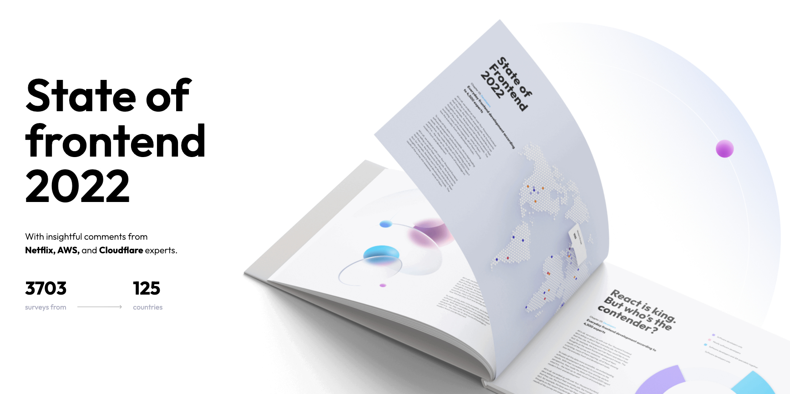

# State of Frontend

Welcome to the State of Frontend, a comprehensive bi-annual report that highlights real-world experiences of all levels and backgrounds. Our [most recent survey][1] reached over 3,700 individuals spanning 125 countries, offering unique insights into the ever-evolving frontend development landscape.

In this repository, we're excited to share the questions that will form the backbone of the 2024 technological side of the State of Frontend 2024 survey.

By involving the community in shaping the survey’s content and structure, we believe we can craft a report that truly reflects the current state and future trends of frontend development.

What should our survey include to capture the essence of frontend development today? It's a question that goes beyond just the tools we use; it's also about understanding the people behind the screens, how they work, and how they see the changes in frontend development.

Explore the first draft of questions and answers in the markdown files linked here:

[State of Frontend 2024](./state-of-frontend-2024/00-start.md)

Everybody is invited to share their suggestions or propose changes in this repository's [issues section][2]. Alternatively, feel free to submit a pull request with your proposed adjustments.

Your insights and contributions will make this report genuinely representative of our vibrant and diverse frontend community and make the final valuable report to all of us.

[1]: https://tsh.io/State-of-Frontend-2022.pdf
[2]: https://github.com/TheSoftwareHouse/state-of-frontend/issues